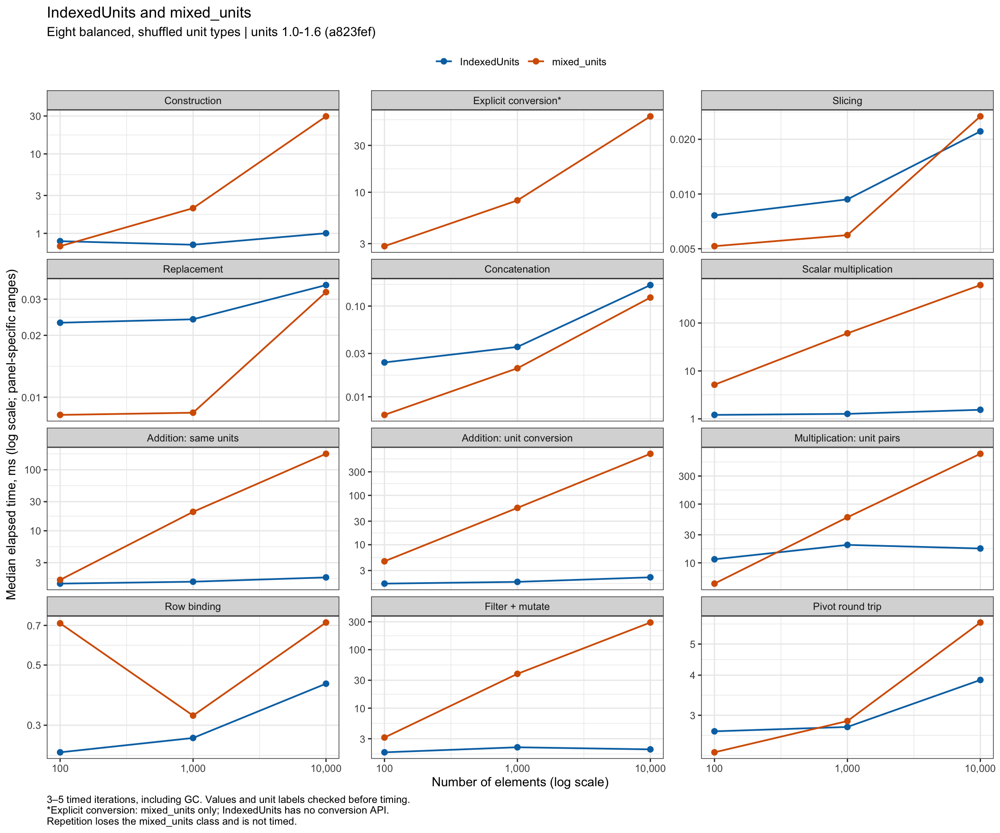
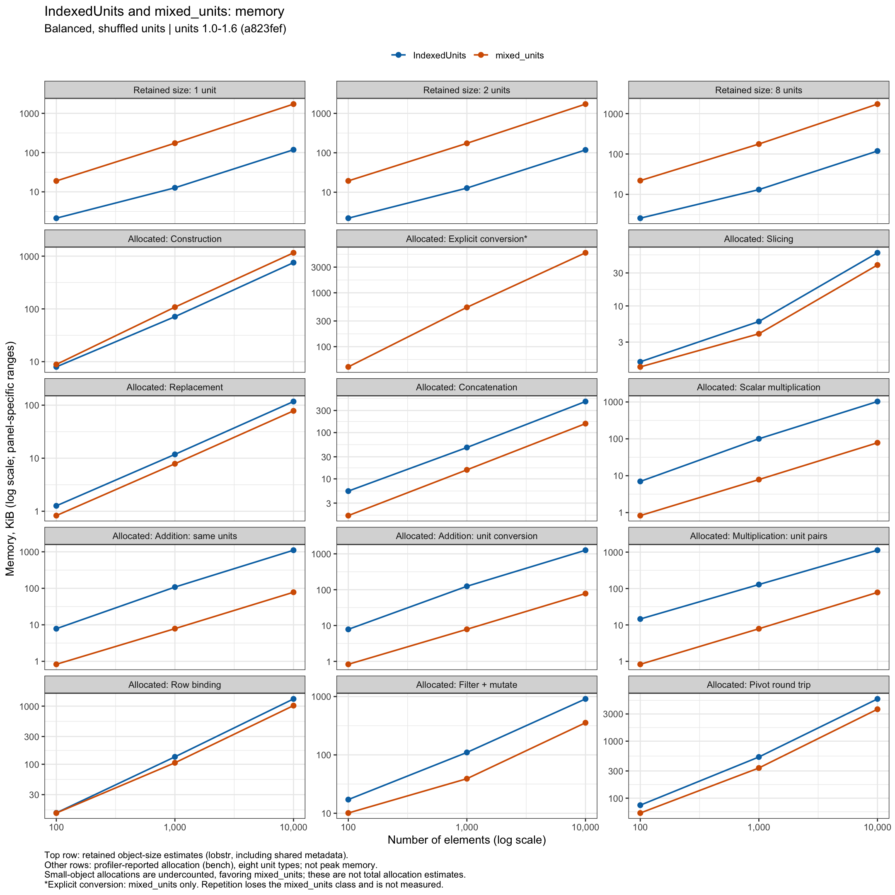

# IndexedUnits vs mixed_units

This benchmark compares `IndexedUnits` with `units::mixed_units`
from GitHub `units` **1.0-1.6**, revision
[`a823fef`](https://github.com/r-quantities/units/commit/a823fef46d92ee4e1b2e2fa28ddf4c19d67cefb6), pinned in `renv.lock`.

Cases investigated:

- **Vector size and unit diversity:** 100, 1,000, and 10,000 elements with 1, 2, or 8 unit types.
- **Unit distribution:** shuffled units, contiguous groups, and a skewed distribution where one unit dominates.
- **Construction and storage:** creating vectors from values and unit labels, and measuring retained memory.
- **Vector operations:** slicing, repetition, replacing 1% of entries, and concatenating vectors with overlapping unit dictionaries.
- **Arithmetic:** scalar multiplication, addition with and without conversion, and multiplication across different unit pairs.
- **Explicit conversion:** `set_units()` on `mixed_units`, checked against conversions of homogeneous `units` vectors. Only `mixed_units` is timed here because `IndexedUnits` has no conversion API.
- **Pipelines:** row binding, filtering with arithmetic in `mutate()`, and long/wide pivot round trips.
- **Missing values:** a sparse pivot followed by printing, checked separately from timings.

Findings (10,000 elements, eight balanced/shuffled unit types):

- **Compact storage and faster arithmetic:** `IndexedUnits` uses about 15× less retained memory than `mixed_units`; addition with conversion is about 318× faster and scalar multiplication about 400× faster.
- **Unit diversity matters:** `IndexedUnits` multiplication is about 41× faster than `mixed_units` with 64 unit pairs, compared with 399× faster with four pairs in the two-type case.
- **Pipelines:** `IndexedUnits` row binding takes 0.43 ms versus 0.72 ms for `mixed_units`; pivots take 3.87 ms versus 5.84 ms. Concatenation is slower for `IndexedUnits`; slicing and replacement are close in absolute time.
- **Memory measurement:** `IndexedUnits` row binding and pivots report 1.36 MB and 5.64 MB of allocations, versus 1.04 MB and 3.72 MB for `mixed_units`. Small-object allocations are undercounted, favoring `mixed_units`; these are not total memory-use estimates.
- **Some behavior differs:** `mixed_units` loses its class under repetition, and its sparse pivot result fails when printed. `IndexedUnits` supports both cases. These are not counted as speedups.

Two-type comparison at the same length (speedup = `mixed_units` time / `IndexedUnits` time):

| Operation | Eight types (main) | Two types |
|---|---:|---:|
| Construction | 30× | 65× |
| Scalar multiplication | 400× | 974× |
| Addition with conversion | 318× | 798× |
| Multiplication across unit pairs | 41× | 399× |
| Row binding | 1.7× | 1.6× |
| Pivot round trip | 1.5× | 1.3× |

`IndexedUnits` retained storage is about 15× smaller than `mixed_units` in both cases. Eight types represent the intended use case of many values sharing relatively few units.

Results are exploratory medians of 3–5 warm-process iterations, including garbage collection. Values and unit labels are checked before timing. Fixtures are prepared outside timings except for construction; retained memory and temporary allocations are measured separately. Small timing differences should be treated cautiously given the few iterations.

The runtime figure shows the eight-unit, balanced/shuffled cases. The memory figure's top row shows retained object size for 1, 2, and 8 unit types; the remaining panels show profiler-reported allocations per operation with eight unit types. These allocations are not peak memory. Each panel has its own logarithmic scale. The full grid is in the raw results.





To reproduce, run from the package root (see the [project README](../../README.md) for the UDUNITS system dependency):

```sh
Rscript -e 'renv::restore()'
Rscript inst/benchmark/run.R
```

The script overwrites [raw results](results/) in one fixed location. These include timings, allocations, object sizes, individual iterations, correctness checks, and [session details](results/session.txt). The script documents the attribute-size workaround used with `lobstr` on this R version.
